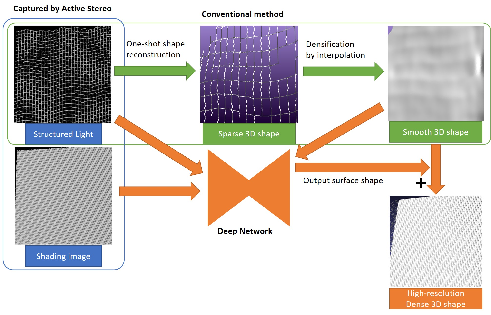
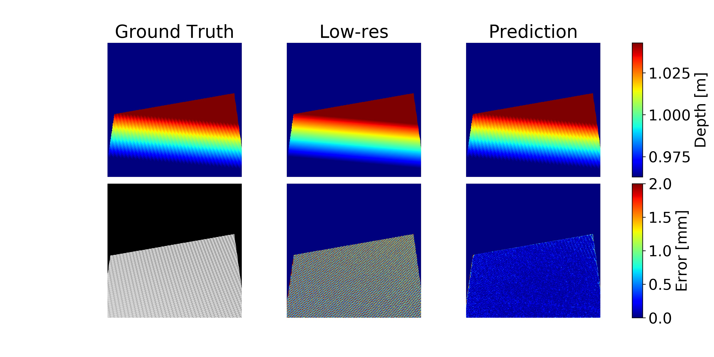

# High-Frequency-Shape-Recovery-from-Shading
Learning based surface high-frequency shape estimator using CNN. It can increase accuracy of sparse depth measured by active stereo method which losts high-frequency shape or unevenness smaller than the density of the projection pattern of object surface. Deep neural network estimates the surface shape from shading image, focused on Shape from Shading methods.



## Introduction
One-shot active stereo method using sparse structured light projection pattern can efficiently reconstruct 3D shape from single pattern projected image. However, it can not get dense depth since its pattern encoded spatially. Conventional method densify the sparse depth by interpolation. This results low-resolution depth with smooth object shape and lost of high-frequency shape or small unevenness of object surface.

Power of deep learning and high-resolution shading information can resolve this issue. The network learns the relationship between shading and shape, and estimates the shape from the shading. In order to train the network efficiently, it needs pattern projected image and low-res depth. Low-res depth means smooth depth which interpolated sparse depth measured by structured light method. ​By inputting shading image, pattern projected image, and low-res depth into the network, the surface shape is output. Accurate dense depth can be obtained by adding the output to low-res depth.

### Network
Deep neural network structure is convolutional network consisting of encoders and decoders with skip connections (U-net). This structure is well suited for this method because it can learn both global and local features and can output high-resolution features.


## Getting Started
Implemented by Python3.

### Framework
Supported deep learning frameworks
- Keras
- PyTorch

### Requirement
- OpenCV
- Numpy
- Pandas
- Matplotlib
- Scikit-learn
- tqdm (optional)

### Download data
Synthetic training/test data, pre-trained model, and prediction samples of pre-trained model are available.

Download from Dropbox: 
https://www.dropbox.com/sh/3mo6w1s80o9pm9m/AADDA58-sj4xVlRN22Dy2_5Na?dl=0

```
root
  ├ Data
  |   └ synthetic (200 tarining/test data)
  ├ Models
  |   └ pre-train_model (model trained on 500 training data)
  └ Outputs
      └ pre-train_model (predictions of pre-train_model)
```

> - Data/synthetic : 200 synthetic training/test data (index: (training)0 - 99, (test)500 - 599)
> - Models/pre-train_model : model trained on 500 synthetic training data (index: 0 - 499)
> - Outputs/pre-train_model : 50 results of pre-train_model on synthetic test data (index: 500 - 549)

---
## Dataset
### High-frequency shape
Since the goal of this method is to recover high-frequency shapes that cannot be recovered by conventional methods, a high-frequency shape dataset is required. Objects with high-frequency shapes, such as cardboard and shoe soles, exist in the real world, but their number is limited and it is difficult to measure their exact shapes by active stereo method. It is too expensive to actually measure and prepare training data for deep learning. Therefore, network is trained with synthetic data and fine-tuned with a small amount of real data.

### Synthetic data
There are publicly available 3D data sets such as ShapeNet, but these data contain a small percentage of the high-frequency shapes that this method requires, making the training less efficient. Therefore, we have created our own synthetic data that fits this method. With a few parameters, various high-frequency shapes can be created, and a dataset with the desired shape can be created by adjusting the parameters.

### Fine-tuning on Real data
A model trained with synthetic data that matches the desired real data shape has high performance, but it can be further improved by fine-tuning it with real data.

---
## Implementation
### Directory

```
root
  ├ scripts
  |   ├ keras (scripts for Keras)
  |   └ pytorch (scripts for PyTorch)
  ├ utils (utils for both implementations) 
  |
  ├ Data
  ├ Models
  └ Outputs
```

### scripts/

> - keras/
> - pytorch/
> - config

### keras/
Script python codes for Keras.

> - train
> - test
> - network
> - loader

### pytorch/
Script python codes for PyTorch.

> - train
> - test
> - network
> - loader

### utils/
Utility codes for both implementations.

> - parser
> - tools
> - plots

---
## Trainig
Run with default parameters.
```
python train.py
```

### Options
Run with options.
```
python train.py --epoch 200 --lr 0.01 --retrain
```
- name : folder name to save trained model (str, default:test) 
- epoch : epoch number (int, default:10) 
- num : training data number (int, default:10)
- lr : learning rate (float, default:0.001)
- drop : dropout rate (float, default:0.2)
- batch : batch size (int, default:8)
- val : validation data rate (float, default:0.3)
- verbose : print training verbose, 0=None, 1=progress bar, 2=one line (int, default:1)
- retrain : is re-train model (flag, default:False)
- finetune : is fine-tune model (flag, default:False)
- generator : is use training generator (loader), when memory is insufficient (flag, default:False)

## Test
Run with default parameters.
```
python test.py
```

### Options
Run with options.
```
python test.py --name pre-train_model --num 20 --ply
```
- name : folder name to save trained model (str, default:test) 
- num : test data number (int, default:10)
- data : kind of data, synthetic or real (str,, default:synthetic)
- ply : is save point cloud .ply file (flag, default:False)
- bmp : is save depth image .bmp file (flag, default:False)


## Pre-trained model
Model trained on 500 synthetic training data is available on Dropbox: https://www.dropbox.com/sh/3mo6w1s80o9pm9m/AADDA58-sj4xVlRN22Dy2_5Na?dl=0

Download pre-trained model and synthetic training/test data, and copy them to  the appropriate folder.

Run
```
python test.py --name pre-train_model
```

## Result
result figure



```
GT depth      | Low-res depth | Prediction depth
------------------------------------------------
Shading image | Low-res error | Prediction error
```
